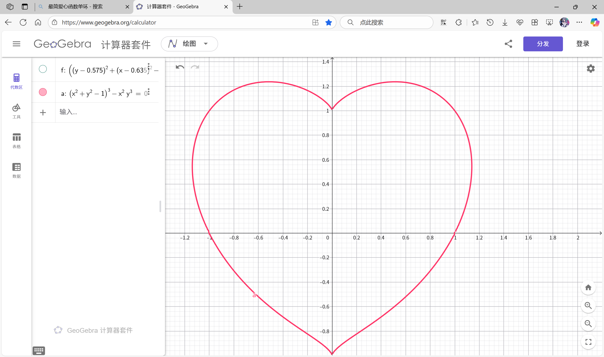
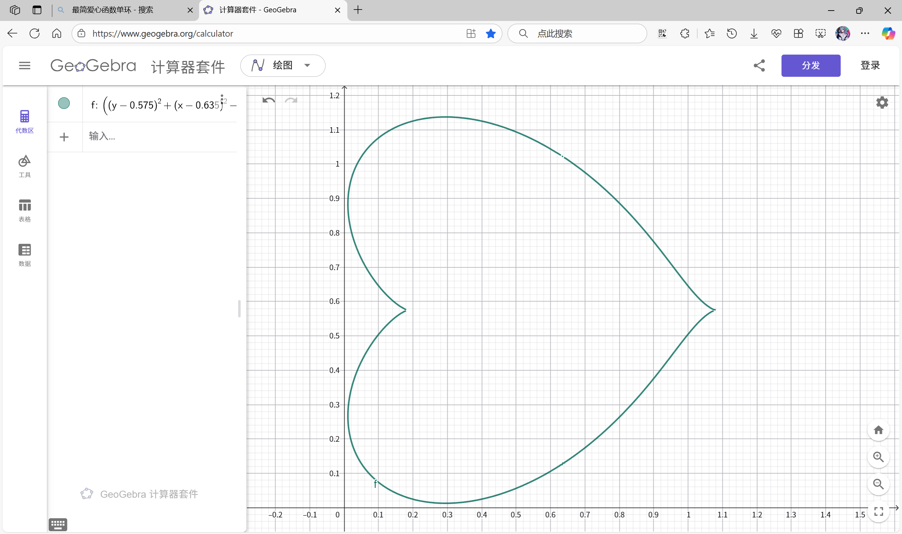

# LoveHeartCreator-cpp
- 如果您是开发者，您可以选择/cpp目录下的源代码进行学习或编译使用。
- 如果您不是开发者，您可以选择/exe目录下已编译好的可执行文件使用。
- 版权所有：https://github.com/JularDepick
- 代码功能解释：
    - $LoveHeartCreator_Basic.cpp$
        - 基于笛卡尔心形曲线的变换，实现了基础的爱心生成展示功能。
        - 细节上：以星号*作为填充字符，并使用空格进行双字节补齐，避免显示异常；设定了控制台前景色为红色。
    - $LoveHeartCreator_Pro.cpp$
        - 基于笛卡尔心形曲线的变换，实现了进阶的爱心生成展示功能。
        - 效果上：能够自定义填充文本和首行提示文本，在控制台上随机变化前景色产生闪烁效果。
        - 细节上：以自定义填充文本为填充爱心内部，以双字节为单位，无须额外的空格补充。
        - 程序输入：$(int,string,string)$
            - 第一个输入为一个 $10-70$ 的正整数，决定爱心的大小和精细程度
            - 第二个输入为一个字符串，可以包含任意可见的中英文字符，将作为自定义填充文本填充到爱心内部
            - 第三个输入为可选项，是一个字符串，将在输出首行固定显示

# 参考编译环境
- 操作系统：$Windows11_64bit$
- 编译器：$TDM-GCC-10.3.0-64bit-Release$
- 编译参数：$-O2 -std=c++17$

# 原理分析
- 数学基础：笛卡尔心形曲线
    - 方程：$(x^2+y^2-1)^3-x^2y^3=0$
    - 图像：
- 实际需求：笛卡尔心形曲线的变换
    - 观察笛卡尔心形曲线，可以发现其图像并不在第一象限，不利于以文本形式展现大致图形，故必然需要通过图像的平移、翻转、旋转等变换使得图像处于第一象限。
    - 我们知道，传统的平面直角坐标系以左下角某点为原点，以水平向右为x轴正方向，以竖直向上为y轴正方向。但是在现代的文本展示规则中，我们一般习惯以 $(x,y)$ 表示“第x行第y列”，即以左上角某点为原点，竖直向下为x轴正方向，以水平向右为y轴正方向。这二者存在差异，需要进行坐标的关系映射。
    - 我们有两种关系映射方案：将文本行列坐标转换为平面直角坐标系坐标，或将平面直角坐标系坐标转换为文本行列坐标。如果选择前者，则需要额外在程序中进行坐标变换计算、添加横纵向的位移修正常量，以保证爱心图形处于平面直角坐标系第一象限且尖角朝下。显然，这存在不必要的计算开销，且并不利于程序代码的简化、结构化和后期阅读理解。所以应当选择后一种映射方案。
    - 将标准的笛卡尔心形曲线进行平移、翻转、旋转等变换，适当调整常数参数后，得到一个较为完美的笛卡尔心形曲线变换式：
        - 方程：$((y-0.575)^2+(x-0.635)^2-0.2)^3+(y-0.575)^2(x-0.635)^3=0$
        - 图像：
        - 图像参数：
            - 定义域：包含且接近于 $(0,1.15)$
            - 值域：包含且接近于 $(0,1.15)$
    - 将这个图形和坐标轴顺时针旋转90度后，我们发现它恰好符合文本行列坐标要求（以左上角某点为原点，竖直向下为x轴正方向，以水平向右为y轴正方向），且图形显示正常（爱心图形处于平面直角坐标系第一象限且尖角朝下），符合要求。需要注意，该图像所占区域大致包含于一个边长为 $1.15$ 个单位长度的正方形中，后文涉及图像尺寸时，默认横向尺寸与纵向尺寸同步。
- 现实条件：从无限可分的抽象图像到有最小单元的实际图形
    - 在控制台程序中，仅依赖原生的C++功能，我们无法以精细图像的形式呈现出目标爱心图形，仅能通过堆砌类似像素的“最小单元”来大致描摹目标爱心图形。在控制台中，通常地，“最小单元”可以是一个半角或全角字符，为了方便显示，我们以一个全角字符的大小作为一个“最小单元”的大小。
    - 然后我们需要确定，这一“最小单元”在笛卡尔心形曲线的变换图像中对应多大的一块区域？我们可以先定义控制台中爱心的大小为 $n$ （正整数，代表爱心的横向跨度，单位为全角字符），其对应笛卡尔心形曲线的变换图像中约 $1.15$ 个单位长度。根据比例尺我们得到，一个“最小单元”对应着平面直角坐标系中一个大小为 $1.15*1.15$ 平方单位长度的正方形区域，将该比例尺记作精度 $prec=1.15/n$ 。
    - 然后，我们以“最小单元”为一个格子，在控制台中划分出一个大小为 $n*n$ 的方格区域，从头到尾枚举每一个方格，将第x行第y列的方格记为 $(x,y)$ ，我们只需要判断 $(x,y)$ 是否符合笛卡尔心形曲线变换式，据此决定该方格是显示（输出一个全角字符）还是隐藏（输出两个空格），最后就能得到像素风格的爱心图形。
    - 按代码描述来说，我们需要建立双层循环：外层循环一个整数 $x$ 从 $0$ 到 $n$，内层循环一个整数 $y$ 从 $0$ 到 $n$；在内层循环中，通过自定义函数判断行列坐标 $(x,y)$ 映射的平面直角坐标系坐标 $(x*prec,y*prec)$ 是否符合笛卡尔心形曲线变换式，如果符合，则输出一个自定义的全角字符（如果是半角字符则在其前面或后面补充一个空格），否则输出两个空格（保证对齐于全角字符）；每当内层循环结束后，输出一个换行字符。这样，我们就能得到一个由自定义字符组成的爱心图形。
    - 值得注意的是，如果 $n$ 过小，图形的精细程度就无法保证，而过大则可能超出控制台显示范围导致显示不全或异常。所以，笔者建议 $n$ 取 $10-70$ 。
- 实际观感与关键数学支撑：从空心到实心、判断点与封闭图像的位置关系
    - 在前文中，我们通过自定义函数判断方格 $(x,y)$ 是否符合笛卡尔心形曲线变换式，只会形成一个空心的爱心。并且如果只是“符合”笛卡尔心形曲线变换式（代入 $(x,y)$ 后方程左边等于右边），由于精度问题，必然导致某些边缘位置出现不连续现象，大大降低观感体验。所以，将爱心图形变为实心是有必要的。
    - 为此，我们需要判断方格 $(x,y)$ 是否在封闭的爱心图形之内。这就需要一个数学知识作为理论支撑：在平面直角坐标系中，对于点 $(x,y)$ 和图形封闭且右侧为零的隐函数/方程 $f(x,y)=0$ ，如果 $(x,y)$ 在 $f(x,y)$ 图形之内（包含边界），则将 $(x,y)$ 代入 $f(x,y)=0$ 后，方程左侧小于等于零。根据这一数学知识，就可以判断某个方格是否位于爱心图形“内部”，实现实心的爱心图形。
    - 至此，源代码 $LoveHeartCreator_Basic.cpp$ 的效果基本实现。
- 更棒的体验：自定义填充文本和控制台文本闪烁
    - 在实现基础的爱心图形功能后，我们发现显示效果还是过于单调，于是我们尝试把爱心图形的组成字符更改为别的文本，即自定义填充文本。该自定义填充文本的用处主要是让爱心图形中“充满”一个人的名字，在表白等场景达到某种浪漫的效果。
    - 确定好自定义填充文本的内容后，我们有两个方案：
        1. 在爱心图形上，从头到尾复制填充自定义文本，如“1234”填充到某一行后可能是“1234123412”，且这一行开头必然是“1234”的一个前缀，各行之间互不影响。
        2. 将爱心图形上的每一个方格从 $1$ 到 $m$ 依次标记上序号，并将这些方格视作一行，然后将自定义文本填充到这一“行”中，如“1234”填充到爱心图形某一行后，开头可能是“1234”中的任意片段。
    - 这两个方案的主要区别是，前者是以爱心图形的每一行为填充单位，而后者是以整个爱心图形的所有显示方格为填充单位。这一区别体现在生成爱心时，最左侧的曲线上的字符相似度不一样。对于第一个方案生成的爱心图形，你大概率会发现其每行的第一个字符是一样的，这在观感上并不舒服。于是，第二个方案成为了更好的选择。
    - 通俗地，我们已经在前文中把方案二的实现思路描述了出来。按代码描述来说，我们需要在先前建立的双层循环外定义一个整数 $idx$ 并初始化为 $0$ ，用于计数爱心图形上的方格；在内层循环中，如果当前方格符合条件，则输出自定义填充文本中索引为 $idx\%len$ 的 $全角字符$；每执行一次判断后， $idx$ 自增一。其中 $idx\%len$ 是为了保证自定义填充文本被循环使用到下一轮填充中，使得爱心图形每一行第一个可见字符大概率地不一样。需要注意，如果自定义填充文本中包含全角字符，则“索引”是以两个半角字符为“最小单位”来计数的。至此，这个程序基本完善。
    - 看着控制台上冷冰冰的爱心图形，你意识到，这静止的图形，怎么可能打动crush那更为静止的心。于是你决定，让这个爱心“动起来”。由于实现爱心的上下左右摇晃效果会造成线性增长的额外开销，容易“摇”出控制台正常显示范围导致显示不全或异常，并且如此规模的输出和清空容易导致控制台卡顿，于是我们决定：只做爱心图形的变色闪烁。
    - 其基本实现思路是：将先前程序的输出内容构造保存到一个字符串 $str$ 中，在程序的最后循环执行以下操作：清空控制台、改变控制台前景色、输出$str$、睡眠等待一段时间。于是得到了最终效果，即源代码 $LoveHeartCreator_Pro.cpp$ 的效果。
    - 至于前景色的变化策略是随机选择还是遵循固定顺序循环，想必很简单，实现也不算难，这里不再赘述，如有兴趣详见源代码。

# 额外的
- 如果您不介意，请为我在抖音上的视频点赞，因为本仓库就是为该视频创建的：[抖音视频链接](https://v.douyin.com/iw5d6BfC53c)
